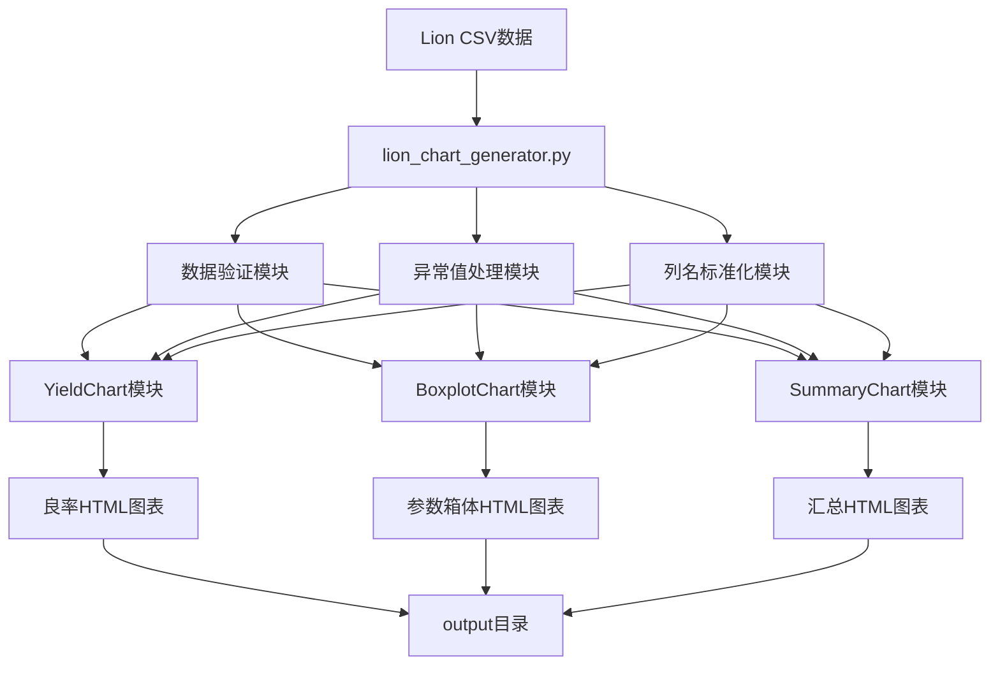

# Lion公司图表生成功能设计文档

## 概述

Lion公司图表生成功能将复用现有的HH公司前端图表模块，为Lion公司的CP测试数据生成专业的HTML图表。该功能基于已完成的数据清洗流程，处理标准化的CSV文件，生成良率分析图表、参数箱体图和汇总分析图表。

设计采用模块化架构，直接复用经过JT公司验证的成熟图表模块，确保零开发成本和高质量输出。

## 架构

### 系统架构图



### 模块依赖关系

- **主控制器**: `lion_chart_generator.py` - 协调所有图表生成流程
- **前端图表模块**: 复用 `frontend.charts.*` 的现有实现
- **数据处理**: 使用pandas进行CSV数据处理
- **异常值检测**: 实现IQR方法的异常值检测器
- **日志系统**: 使用标准logging模块记录处理过程

## 组件和接口

### 1. 主控制器组件 (lion_chart_generator.py)

#### 接口设计
```python
def main() -> None:
    """Lion公司图表生成主函数"""

def generate_yield_charts(data_dir: Path, output_dir: Path) -> List[Path]:
    """生成良率图表，返回保存的文件路径列表"""

def generate_boxplot_charts(data_dir: Path, output_dir: Path) -> List[Path]:
    """生成参数箱体图，返回保存的文件路径列表"""

def generate_summary_chart(data_dir: Path, output_dir: Path) -> Optional[Path]:
    """生成汇总图表，返回保存的文件路径"""
```

#### 核心职责
- 协调整个图表生成流程
- 验证输入数据的完整性
- 调用各个图表生成模块
- 处理异常和错误日志
- 生成处理结果报告

### 2. 数据验证组件

#### 接口设计
```python
def validate_csv_files(data_dir: Path) -> Dict[str, bool]:
    """验证必要的CSV文件是否存在且格式正确"""

def validate_data_completeness(df: pd.DataFrame) -> Dict[str, Any]:
    """验证数据完整性和质量"""

def get_test_parameters(cleaned_df: pd.DataFrame) -> List[str]:
    """从cleaned CSV中提取测试参数列名"""
```

#### 验证规则
- 检查3个必要CSV文件的存在性
- 验证CSV文件格式和编码
- 检查关键列的存在性（Lot_ID, Wafer_ID, X, Y, Bin等）
- 验证数值型参数的数据质量
- 检查数据行数和完整性

### 3. 异常值处理组件

#### 接口设计
```python
class LionOutlierHandler:
    def __init__(self, method: str = "iqr", threshold: float = 1.5):
        """初始化异常值处理器"""
    
    def detect_outliers(self, df: pd.DataFrame, parameter: str) -> pd.Series:
        """检测指定参数的异常值，返回布尔掩码"""
    
    def handle_outliers(self, df: pd.DataFrame) -> Tuple[pd.DataFrame, Dict]:
        """处理所有参数的异常值，返回处理后数据和统计信息"""
    
    def generate_outlier_report(self, stats: Dict) -> str:
        """生成异常值处理报告HTML"""
```

#### 处理策略
- 使用IQR方法检测异常值：Q1 - 1.5×IQR ≤ 正常值 ≤ Q3 + 1.5×IQR
- 将异常值标记为NaN，保持数据结构完整
- 按参数分别处理，避免跨参数影响
- 生成详细的异常值统计报告
- 记录处理前后的数据质量对比

### 4. 列名标准化组件

#### 接口设计
```python
def standardize_column_names(df: pd.DataFrame) -> pd.DataFrame:
    """标准化CSV列名以匹配HH格式要求"""

def validate_required_columns(df: pd.DataFrame) -> List[str]:
    """验证必要列的存在性，返回缺失列列表"""
```

#### 标准化规则
- 确保关键列名符合HH格式：Lot_ID, Wafer_ID
- 保持测试参数列名不变
- 处理可能的列名变体和大小写问题
- 验证标准化后的列名完整性

### 5. 前端图表模块集成

#### YieldChart集成
```python
# 复用现有YieldChart模块
from frontend.charts.yield_chart import YieldChart

yield_analyzer = YieldChart(data_dir=str(data_dir))
yield_analyzer.load_data()
saved_charts = yield_analyzer.save_all_charts(output_dir=str(output_dir))
```

#### BoxplotChart集成
```python
# 复用现有BoxplotChart模块
from frontend.charts.boxplot_chart import BoxplotChart

boxplot_analyzer = BoxplotChart(data_dir=str(data_dir))
boxplot_analyzer.load_data()
available_params = boxplot_analyzer.get_available_parameters()
saved_charts = boxplot_analyzer.save_all_charts(output_dir=str(output_dir))
```

#### SummaryChart集成
```python
# 复用现有SummaryChart模块
from frontend.charts.summary_chart import SummaryChart

summary_analyzer = SummaryChart(data_dir=str(data_dir))
summary_analyzer.load_data()
saved_chart = summary_analyzer.save_summary_chart(output_dir=str(output_dir))
```

## 数据模型

### 输入数据模型

#### Cleaned CSV结构
```
列名: Lot_ID, Wafer_ID, X, Y, Seq, Bin, SITE_NUM, CONT, T_TIME, TEST_NUM, 
      GLOBALCOND, DC_KELVIN_B1, DC_KELVIN_C1, DC_KELVIN_E1, IGSSF_5, 
      IGSSF_20, IGSSR_20, IGSSF_30, IGSSR_30, IGSSF_40, IGSSR_40, VTH1, 
      IDSS_1500, HBVDSS1-100uA, HBVDSS2-250uA, HBVDSS3-1mA, HBVDSS4-50uA, 
      HBVDSS5-250uA, VTH2, DVR_VGS(TH), DVR_BVDSS2, DVR_BVDSS3, 
      DVR_BVDSS4, DVR_BVDSS5, RDSON, VFSD, IDSS_1200, IDSS_50, 
      IDSS_1500_Retest, IGSSF_20_Retest, IGSSR_20_Retest

数据类型: 混合（字符串、整数、浮点数）
行数: ~1008行（每个芯片一行）
```

#### Spec CSV结构
```
列名: Parameter, TEST_NUM, GLOBALCOND, [测试参数列], UNIT, LIMIT_LOW, LIMIT_HIGH
行数: ~13行（每个测试参数一行）
用途: 提供参数规格限制信息
```

#### Yield CSV结构
```
列名: Lot_ID, Wafer_ID, Gross_die, Good_die, Yield, [测试参数统计列]
行数: ~9行（每个晶圆一行）
用途: 提供良率统计信息
```

### 输出数据模型

#### HTML图表文件
```
良率图表:
- lion_yield_trend.html (良率趋势分析)
- lion_failure_analysis.html (失效类型分析)  
- lion_batch_comparison.html (批次对比分析)

参数箱体图:
- lion_{parameter}_boxplot.html (每个测试参数一个文件)
- 预计生成30+个文件

汇总图表:
- lion_summary_analysis.html (综合分析报告)

异常值报告:
- lion_outlier_report.html (异常值处理报告)
```

## 错误处理

### 错误分类和处理策略

#### 1. 数据文件错误
- **文件不存在**: 记录错误日志，提供清晰的文件路径提示
- **文件格式错误**: 尝试多种编码方式读取，失败时跳过该文件
- **数据为空**: 记录警告信息，跳过相关图表生成

#### 2. 数据质量错误
- **列名不匹配**: 自动进行列名标准化转换
- **数据类型错误**: 尝试类型转换，失败时标记为NaN
- **数据不足**: 记录警告信息，跳过该参数的图表生成

#### 3. 图表生成错误
- **前端模块异常**: 捕获异常，记录详细错误信息，继续处理其他图表
- **文件保存失败**: 检查目录权限，提供解决建议
- **内存不足**: 优化数据处理，分批处理大数据集

#### 4. 系统级错误
- **导入模块失败**: 检查依赖库安装，提供安装指导
- **权限错误**: 提供权限设置建议
- **磁盘空间不足**: 检查可用空间，提供清理建议

### 错误恢复机制

```python
def robust_chart_generation(chart_func, *args, **kwargs):
    """通用的图表生成错误恢复包装器"""
    try:
        return chart_func(*args, **kwargs)
    except Exception as e:
        logger.error(f"图表生成失败: {e}")
        logger.exception("详细错误信息:")
        return None

# 使用示例
yield_charts = robust_chart_generation(generate_yield_charts, data_dir, output_dir)
```

## 测试策略

### 单元测试

#### 数据验证测试
- 测试CSV文件存在性检查
- 测试数据格式验证
- 测试列名标准化功能
- 测试异常值检测算法

#### 图表生成测试
- 测试良率图表生成功能
- 测试参数箱体图生成功能
- 测试汇总图表生成功能
- 测试错误处理机制

### 集成测试

#### 端到端测试
- 使用Lion公司实际数据进行完整流程测试
- 验证生成的HTML文件在浏览器中的显示效果
- 测试不同数据规模的处理性能
- 验证与现有数据清洗流程的集成

#### 兼容性测试
- 测试不同批次Lion数据的处理
- 验证HTML图表在不同浏览器中的兼容性
- 测试异常数据情况下的系统稳定性

### 性能测试

#### 基准测试
- 1008行芯片数据的处理时间应<30秒
- 单个HTML文件大小应<10MB
- 内存使用峰值应<1GB

#### 压力测试
- 测试处理多个批次数据的能力
- 验证大量参数（50+）的处理性能
- 测试并发图表生成的稳定性

### 测试数据

#### 标准测试数据
- 使用现有的V25220080批次数据作为基准
- 创建包含异常值的测试数据集
- 准备不完整数据的测试用例

#### 边界测试数据
- 空数据文件
- 单行数据文件
- 超大数据文件（10000+行）
- 包含特殊字符的数据

## 部署和维护

### 部署要求

#### 环境依赖
- Python 3.7+
- pandas >= 1.3.0
- plotly >= 5.0.0
- pathlib (标准库)

#### 文件结构
```
lion/
├── lion_chart_generator.py (主程序)
├── outlier_handler.py (异常值处理)
└── data_validator.py (数据验证)

output/ (数据目录)
├── *_cleaned_*.csv
├── *_spec_*.csv
├── *_yield_*.csv
└── *.html (生成的图表)
```

### 维护策略

#### 日志监控
- 使用标准logging模块记录所有操作
- 设置不同级别的日志输出
- 定期检查错误日志和性能指标

#### 版本控制
- 跟踪前端图表模块的版本变化
- 维护Lion特定配置的版本历史
- 记录数据格式变更的影响

#### 性能优化
- 定期分析处理时间和内存使用
- 优化大数据集的处理算法
- 监控HTML文件大小增长趋势