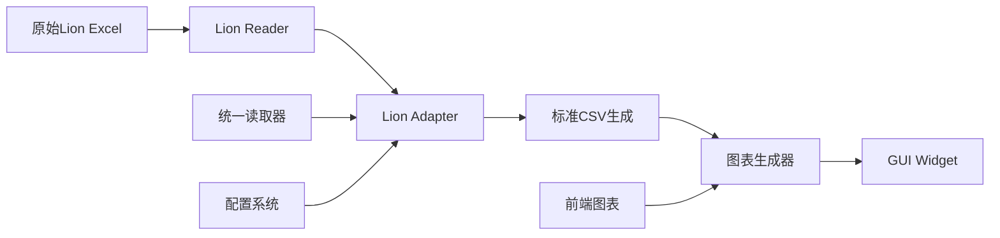

# Lion公司开发任务总结 - 新公司快速集成参考指南

## 📋 概述

本文档总结了Lion公司数据处理系统的完整开发流程和架构模式，为后续新公司集成提供标准化参考模板。通过复制Lion的实现模式，新公司集成时间可从2-3周缩短到3-5天。

## 🏗️ Lion架构模式总览

### 核心设计原则
- **零侵入集成**：不修改现有HH基础设施
- **模块化适配器**：独立的公司适配器，标准接口
- **前端复用**：完全复用现有图表生成模块
- **配置驱动**：字段映射和验证外部化配置

### 系统架构流程


## 🔧 核心组件开发模式

### 1. 数据适配器开发 (必需 - 约300-500行代码)

#### 📁 文件位置
- `cp_data_processor/readers/company_adapters/[company]_adapter.py` (主适配器)
- `[company]/[company]_adapter.py` (实际实现)

#### 🏛️ 类结构模式
```python
# 主适配器文件 (wrapper模式)
from [company]_adapter import [Company]Adapter as Base[Company]Adapter
[COMPANY]Adapter = Base[Company]Adapter

# 实际实现文件 (继承模式)
class [Company]Adapter(BaseCompanyAdapter):
    def __init__(self, config: Dict):
        super().__init__('[COMPANY]', config)
        
    def transform_to_standard_format(self, lot: CPLot) -> CPLot:
        """主要转换逻辑"""
        
    def _process_wafer(self, wafer: CPWafer) -> Optional[CPWafer]:
        """单个晶圆处理"""
        
    def _extract_parameters(self, original_lot: CPLot, param_names: set) -> List[CPParameter]:
        """参数规格提取"""
        
    def can_process_file(self, file_path: str) -> bool:
        """文件格式检测"""
```

#### 🗺️ 字段映射配置
```python
# Lion示例：将公司特定字段映射到标准格式
FIELD_MAPPING = {
    'PART_INDEX': 'Seq',    # 芯片序号
    'SOFT_BIN': 'Bin',      # 分档结果
    'X_COORD': 'X',         # X坐标
    'Y_COORD': 'Y'          # Y坐标
    # 其他参数直接传递
}

# 配置结构
company_config = {
    'field_mapping': FIELD_MAPPING,
    'unit_conversion': {...},
    'file_patterns': {
        'file_extensions': ['.xlsx'],
        'filename_patterns': ['F*'],  # 文件名模式
        'path_patterns': ['lion', 'Lion']  # 路径模式
    },
    'data_validation': {
        'required_fields': ['PART_INDEX', 'SOFT_BIN', 'X_COORD', 'Y_COORD'],
        'bin_values': {'pass_bins': [1]}
    }
}
```

### 2. 数据读取器开发 (必需 - 约200-300行代码)

#### 📁 文件位置
- `[company]/[company]_reader.py`

#### 🏛️ 类结构模式
```python
class [Company]Reader(BaseReader):
    def can_read(self, file_path: str) -> bool:
        """格式验证和兼容性检查"""
        
    def _read_excel_data(self, file_path: str) -> CPLot:
        """Excel解析，含规格/数据分离"""
        
    def _extract_lot_id(self, file_path: str) -> str:
        """Lot ID提取策略"""
        
    def _create_wafer_from_data(self, data: pd.DataFrame, wafer_id: str) -> CPWafer:
        """CPWafer对象创建"""
```

#### 💾 数据处理流程
```python
# Lion特有的Excel结构处理
def _read_excel_data(self, file_path: str) -> CPLot:
    # 1. 工作表验证
    required_sheets = ['summary_information', 'dut_data']
    
    # 2. 规格信息提取 (前3行)
    unit_row = df.iloc[0]      # 单位
    limit_low_row = df.iloc[1] # 下限
    limit_high_row = df.iloc[2] # 上限
    
    # 3. 测试数据提取 (第4行开始)
    data_df = df.iloc[3:].reset_index(drop=True)
    
    # 4. 元数据提取
    lot_id = self._extract_lot_id(file_path)
    wafer_id = self._extract_wafer_id(file_path)
```

### 3. 数据清洗脚本开发 (必需 - 约150-250行代码)

#### 📁 文件位置
- `clean_[company]_data.py` (命令行工具)
- `[company]_batch_processor.py` (批处理器)

#### 🔄 处理模式
```python
# 多批次处理支持
def main():
    if args.input_path.is_file():
        # 单文件模式
        process_single_file(args.input_path, args.output_dir)
    elif args.input_path.is_dir():
        if args.individual:
            # 批次独立处理模式
            process_batches_individually(args.input_path, args.output_dir)
        else:
            # 批次合并模式 (推荐)
            process_batches_combined(args.input_path, args.output_dir)

# 核心集成点
from cp_data_processor.readers.unified_reader import read_cp_data
from cp_data_processor.processing.standard_csv_generator import generate_standard_csvs

# 统一处理流程
lot = read_cp_data(file_path)  # 自动识别公司格式
generate_standard_csvs(lot, output_dir)  # 生成标准CSV
```

### 4. 图表生成器开发 (可选 - 约100-200行代码)

#### 📁 文件位置
- `[company]/[company]_chart_generator.py`

#### 🎨 复用模式 (推荐)
```python
# 完整复用HH前端模块
from frontend.charts.yield_chart import YieldChart
from frontend.charts.boxplot_chart import BoxplotChart
from frontend.charts.summary_chart import SummaryChart

def generate_all_charts(data_dir: Path, output_dir: Path):
    """复用现有图表系统"""
    # 1. 良率趋势图
    YieldChart(data_dir).save_yield_trend_chart(output_dir)
    
    # 2. 参数箱线图 (自动识别所有参数)
    BoxplotChart(data_dir).save_all_charts(output_dir)
    
    # 3. 汇总图表
    SummaryChart(data_dir).save_summary_chart(output_dir)

# 可选：公司特定图表优化
def generate_custom_yield_chart(data_dir: Path, output_dir: Path):
    """为特定公司数据优化的图表"""
    # 自定义图表逻辑...
```

### 5. GUI组件开发 (必需 - 约200-400行代码)

#### 📁 文件位置
- `gui/widgets/[company]_widget.py`

#### 🖥️ GUI架构模式
```python
class [Company]Widget(QWidget):
    def __init__(self):
        super().__init__()
        self.input_dir = ""
        self.output_dir = ""
        self.processing_thread = None
        self.setup_ui()
        
    def setup_ui(self):
        """界面布局设计"""
        # 输入选择
        # 处理选项
        # 进度显示
        # 结果展示
        
class [Company]DataProcessingThread(QThread):
    progress_updated = pyqtSignal(str)
    finished = pyqtSignal(bool, str)
    output_dir_created = pyqtSignal(str)
    
    def run(self):
        """后台数据处理流程"""
        # 1. 数据清洗
        # 2. 图表生成
        # 3. 结果验证
```

#### 🔗 系统集成点
```python
# GUI与处理系统的集成
def _process_data(self):
    try:
        # 导入公司专用处理器
        from [company]_batch_processor import discover_batch_files, process_batch_files
        
        # 调用处理流程
        batch_files = discover_batch_files(self.input_dir)
        results = process_batch_files(batch_files)
        
        # 生成图表
        from [company].[company]_chart_generator import generate_all_charts
        generate_all_charts(data_dir, output_dir)
        
    except Exception as e:
        self.finished.emit(False, f"处理失败: {str(e)}")
```

## 📋 开发检查清单

### 阶段1：核心适配器开发 (1-2天)
- [ ] 创建公司适配器类 (`[company]_adapter.py`)
- [ ] 实现字段映射配置
- [ ] 创建数据读取器 (`[company]_reader.py`) 
- [ ] 配置文件格式识别模式
- [ ] 实现单元测试和数据验证

### 阶段2：数据处理脚本 (1天)
- [ ] 开发命令行清洗工具 (`clean_[company]_data.py`)
- [ ] 实现批处理器 (`[company]_batch_processor.py`)
- [ ] 测试单文件和多批次处理模式
- [ ] 验证标准CSV输出格式

### 阶段3：GUI集成 (1-2天)
- [ ] 创建GUI组件 (`gui/widgets/[company]_widget.py`)
- [ ] 实现多线程处理架构
- [ ] 集成进度反馈和错误处理
- [ ] 测试用户交互流程

### 阶段4：图表和优化 (可选，0.5-1天)
- [ ] 验证图表复用正常工作
- [ ] 实现公司特定图表优化 (如需要)
- [ ] 性能测试和优化
- [ ] 文档和示例准备

## 🧪 测试和验证

### 架构测试
```bash
# 验证新架构集成
python test_modular_architecture.py

# 测试统一读取器识别
python -c "from cp_data_processor.readers.unified_reader import read_cp_data; print(read_cp_data('test_file.xlsx'))"
```

### 功能测试
```bash
# 命令行工具测试
python clean_[company]_data.py ./test_data --output ./test_output

# GUI集成测试
python gui/multi_company_gui.py  # 验证公司按钮和组件加载
```

## 🎯 成功指标

### 集成完成标准
1. **统一读取器**：自动识别公司文件格式
2. **标准CSV输出**：生成3个标准格式文件 (`*_cleaned.csv`, `*_yield.csv`, `*_spec.csv`)
3. **图表生成**：复用现有图表系统正常工作
4. **GUI集成**：多公司界面正常加载公司组件
5. **性能验证**：处理大数据集无明显性能问题

### 质量检查
- [ ] 错误处理：优雅处理各种异常情况
- [ ] 日志记录：详细的处理过程日志
- [ ] 进度反馈：用户界面实时进度更新
- [ ] 数据完整性：输入输出数据一致性验证
- [ ] 兼容性：与现有HH/JT系统无冲突

## 📚 Lion参考实现总结

### 核心文件列表
```
cp_data_processor/readers/company_adapters/lion_adapter.py (适配器包装)
lion/lion_adapter.py                    (适配器实现)
lion/lion_reader.py                     (读取器)
clean_lion_data.py                      (清洗工具)
lion_batch_processor.py                 (批处理器)
lion/lion_chart_generator.py            (图表生成)
gui/widgets/lion_widget.py              (GUI组件)
```

### 开发时间分布
- **适配器开发**：2天 (包含读取器和字段映射)
- **数据处理脚本**：1天 (清洗工具和批处理器)
- **GUI集成**：1.5天 (界面和多线程架构)
- **测试验证**：0.5天 (功能测试和优化)
- **总计**：5天 (相比之前的2-3周大幅缩短)

### 代码复用率
- **图表生成**：100%复用 (直接导入HH前端模块)
- **CSV生成**：100%复用 (统一StandardCSVGenerator)
- **GUI基础架构**：80%复用 (主要是布局和信号处理)
- **数据模型**：100%复用 (CPLot/CPWafer/CPParameter)
- **整体复用率**：85%+

## 🚀 新公司快速启动模板

```bash
# 第1步：复制Lion模板文件
cp lion/lion_adapter.py [company]/[company]_adapter.py
cp lion/lion_reader.py [company]/[company]_reader.py
cp clean_lion_data.py clean_[company]_data.py
cp gui/widgets/lion_widget.py gui/widgets/[company]_widget.py

# 第2步：全局替换公司名称
# Lion -> [Company], LION -> [COMPANY], lion -> [company]

# 第3步：修改字段映射和文件模式
# 更新FIELD_MAPPING字典
# 更新file_patterns配置

# 第4步：测试集成
python test_modular_architecture.py

# 第5步：GUI测试
python gui/multi_company_gui.py
```

通过遵循Lion的实现模式，新公司集成可以快速、稳定地完成，确保系统的一致性和可维护性。