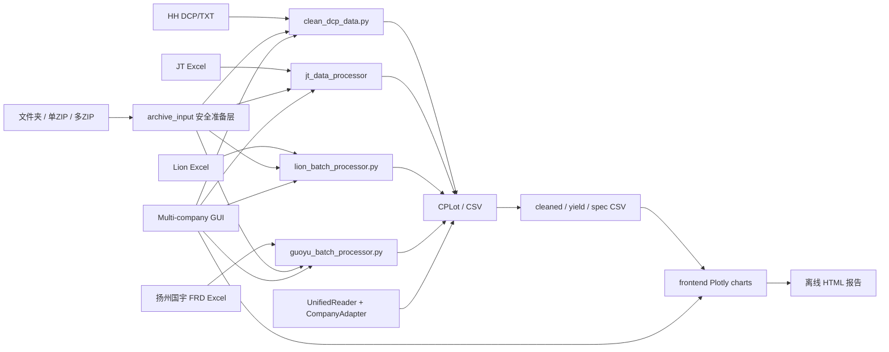

# 系统架构

## 1. 业务目标

平台将不同晶圆厂或测试厂输出的 CP 数据转换为统一分析数据，用于：

- 批次和 Wafer 良率分析
- Bin 失效结构分析
- 测试参数分布、离群值和规格对比
- 多批次对比与离线 HTML 报告
- 后续与产品、封装、终测、成本和毛利数据关联

当前范围聚焦 CP 数据，不包含 SAP Business One 主数据或成本核算集成。

## 2. 当前真实架构

### 关键判断

- `cp_data_processor/` 是目标核心架构，包含统一模型、Reader、适配器和标准 CSV 生成器。
- `UnifiedReader` 已支持 HH、JT、Lion、扬州国宇，但并非所有成熟流程的唯一入口。
- 多公司 GUI 当前直接调用公司专用处理流程，再复用图表层。
- `frontend/` 主要消费标准 CSV，而不是直接消费原始厂商文件。
- `python_cp/` 和公司专用模块仍被部分主流程引用，未完成迁移前不能直接删除。

### 统一输出目录契约

HH、JT、Lion、国宇四条 GUI 清洗流程统一通过 `cp_data_processor.processing.output_naming` 创建运行目录，格式为 `<首个真实批次号>_YYYYMMDD_HHMMSS`。多批次输入按稳定的识别/处理顺序使用第一个批次号；目录名称只代表本次运行的命名锚点，标准 CSV 中每行原始 `Lot_ID` 仍必须保留。若同一秒重复运行，追加 `_001`、`_002` 防止覆盖已有结果。

## 3. 模块职责

| 模块 | 当前职责 | 状态 |
| --- | --- | --- |
| `cp_data_processor/data_models/` | 定义 `CPLot`、`CPWafer`、`CPParameter` | 核心 |
| `cp_data_processor/readers/` | HH Reader、统一 Reader、公司注册 | 核心 |
| `cp_data_processor/readers/company_adapters/` | 字段映射、单位转换、公司识别 | 核心 |
| `cp_data_processor/processing/` | ZIP 安全准备、清洗、转换、标准 CSV、性能处理 | 核心 |
| `frontend/charts/` | 标准 CSV 到 Plotly HTML | 核心 |
| `gui/widgets/` | 多公司 GUI 工作流编排 | 核心 |
| `jt_data_processor/` | JT 专用成熟处理链 | 兼容且仍在用 |
| `lion/` 与 `lion_batch_processor.py` | Lion 专用读取、合并、图表 | 兼容且仍在用 |
| `guoyu/` 与 `guoyu_batch_processor.py` | 扬州国宇 FRD 读取、单位解析、批次处理与图表 | 核心 |
| `python_cp/` | 华虹良率等历史兼容逻辑 | 兼容且仍在用 |

## 4. 公司处理路径

### HH / 华虹宏力

GUI 支持原始 DCP/TXT 文件夹、单个 ZIP、多个 ZIP，以及只包含 ZIP 的输入文件夹。ZIP 输入通过 `cp_data_processor.processing.zip_input` 兼容入口调用公共 `archive_input` 安全准备层，规整为原处理器可识别的一层/两层临时目录，再调用 `clean_dcp_data.process_directory()`；临时文件在处理结束后自动删除。后续流程仍包含 DCP 读取、IQR 清洗、cleaned CSV、yield CSV、spec 提取和可选单位转换，图表直接使用共用 `frontend` 组件。

### JT / Jetech

GUI 支持 Excel 文件夹、单个/多个 ZIP 和只包含 ZIP 的文件夹。ZIP 经公共安全准备层提取 Excel 后，仍调用 `jt_data_processor.jt_main_processor.process_jt_files()`；输出目录名从真实 JT 批次号生成，再复用共用图表组件。

### Lion

GUI 支持 Excel 文件夹、单个/多个 ZIP 和只包含 ZIP 的文件夹。准备完成后仍由 `lion_batch_processor` 发现批次、读取每个 Excel、标准化并合并为一个 `CPLot`，通过 `StandardCSVGenerator` 输出 CSV；输出目录名使用首个成功解析文件的真实 `lot_id`，Lion 图表生成器会增加异常值处理和列名标准化步骤。

### 扬州国宇 FRD

批次目录名作为批量处理时的 `Lot_ID`，每个 JUNO DTS-2000 Excel 文件对应一片 Wafer。输入支持单批次目录、产品多批次目录，以及单个/多个 ZIP；ZIP 解压时保留批次与 EDS 层级，并识别常见产品包装目录。多批次处理合并为同一套标准 CSV，并保留每行原始 `Lot_ID`；输出目录按第一个真实批次号加时间流水号命名。`GuoyuFRDReader` 解析元数据、规格、工程单位和 Die 明细，经 `GUOYUAdapter` 校验后输出标准 CSV；GUI 和 `guoyu_batch_processor.py` 均可调用该流程。

## 5. 扩展原则

新增能力优先落在以下边界：

- 新厂商原始格式：Reader + CompanyAdapter
- 跨厂商公共逻辑：`cp_data_processor/`
- 基于标准 CSV 的图表：`frontend/`
- GUI 编排：`gui/widgets/`

不要继续复制整套公司专用图表代码。新增公司应尽量输出统一 CSV 后复用 `frontend`。
