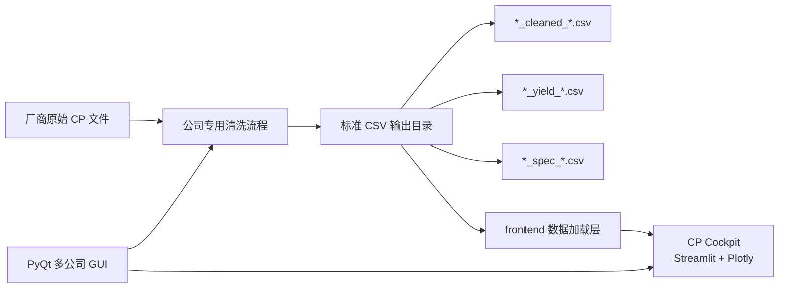

# CP 前端系统设计

## 1. 设计原则

CP 前端遵循以下原则：

1. 清洗与展示分离：Reader / Processor 负责清洗，前端只负责加载标准 CSV 和展示图表。
2. 标准数据契约优先：前端入口统一消费 `cleaned`、`yield`、`spec` 三类 CSV。
3. GUI 与命令行并存：普通用户从 GUI 使用，IT 或开发人员可用 CLI 自动化。
4. 离线优先：报告应尽量支持内网和无公网环境使用。
5. 不静默改数据：图表阶段不改变测试值、Bin、规格上下限。

## 2. 总体架构



## 3. 模块职责

| 模块 | 职责 |
| --- | --- |
| `gui/multi_company_gui.py` | 多公司桌面入口，提供公司清洗和 CP Cockpit 按钮 |
| `gui/widgets/` | 各公司数据清洗界面，维护输入输出路径 |
| `frontend/cp_dashboard_app.py` | Streamlit 交互式 Cockpit 主界面 |
| `frontend/yield_analyzer_app.py` | 兼容入口，转到 `cp_dashboard_app.py` |
| `frontend/charts/` | Plotly 离线图表组件 |
| `docs/data-contracts.md` | 前端和清洗程序共同遵守的数据契约 |

## 4. 数据流设计

### 4.1 清洗阶段

用户在 GUI 中选择公司和输入目录，清洗流程输出：

```text
output/<批次或流水目录>/
  <lot>_cleaned_YYYYMMDD_HHMM.csv
  <lot>_yield_YYYYMMDD_HHMM.csv
  <lot>_spec_YYYYMMDD_HHMM.csv
```

清洗阶段负责：

- 原始文件解析
- 字段映射
- 单位转换
- Bin 判断
- 规格提取
- CSV 输出

### 4.2 前端加载阶段

前端从用户选择的输出目录开始递归查找最新的标准 CSV。这一点很重要，因为真实输出经常在 `output/<batch>/` 子目录中。

查找规则：

```text
cleaned: *_cleaned_*.csv 或 *cleaned*.csv
yield:   *_yield_*.csv   或 *yield*.csv
spec:    *_spec_*.csv    或 *spec*.csv
```

### 4.3 图表展示阶段

前端根据标准字段生成图表：

| 数据来源 | 主要消费图表 |
| --- | --- |
| cleaned | BoxPlot、散点、Wafer Map、区域分析、Cpk、数据预览 |
| yield | 良率趋势、Wafer 汇总 |
| spec | 规格线、Cpk、超限统计 |

## 5. CP Cockpit 设计

CP Cockpit 是交互式分析界面，适合工程师边看边切换参数。

入口：

```powershell
streamlit run frontend/yield_analyzer_app.py
```

GUI 打开时会：

1. 获取当前公司页面的输出目录。
2. 如果 `127.0.0.1:8501` 未启动，则启动 Streamlit。
3. 通过 URL 参数 `?data_dir=...` 和环境变量 `CP_COCKPIT_DATA_DIR` 传入数据目录。
4. 用浏览器打开本地页面。

主要页面包括：

- 总览
- 良率和 Bin
- 参数 BoxPlot
- 参数 Wafer 散点图
- Wafer Mapping（全部 Lot/Wafer 轻量总览，或选择 1～25 片详看；可选择综合 Bin 或具体测试参数）
- 区域分析
- 失效叠加
- Wafer Summary
- Cpk / 超限
- 数据预览

## 6. 关键数据映射

| 标准 CSV 字段 | 前端用途 | 用途 |
| --- | --- | --- |
| `Lot_ID` | 批次显示和分组 | BoxPlot、良率趋势、追溯 |
| `Wafer_ID` | Wafer 序列 | BoxPlot X 轴、Wafer 选择、Summary |
| `X` | Wafer Mapping 横坐标 | die 方格空间图与区域分析 |
| `Y` | Wafer Mapping 纵坐标 | die 方格空间图与区域分析 |
| `Seq` | `Seq` | Die 顺序 |
| `Bin` | 良率和失效标识 | 良率、失效 Bin |
| 参数列 | 同名参数 | 统计图和 Cpk |
| `spec.LimitL/LSL` | 规格下限 | 规格线、Cpk |
| `spec.LimitU/USL` | 规格上限 | 规格线、Cpk |

## 7. 错误处理和数据限制

| 情况 | 前端行为 | 建议排查 |
| --- | --- | --- |
| 找不到 cleaned CSV | 提示未找到标准数据 | 检查是否先完成清洗，输出目录是否正确 |
| 找不到 spec CSV | 图表仍可显示，规格/Cpk 不完整 | 检查清洗流程是否提取规格 |
| `X/Y` 全为 0 | Wafer Mapping 无真实空间分布 | 回到 Reader / Adapter 检查坐标来源 |
| 参数没有 LSL/USL | 不生成该参数的不良 Mapping | 检查 spec CSV 是否缺规格 |
| `LSL > USL` | 明确提示规格方向异常，不自动交换 | 回到清洗/spec 生成环节修正规格 |
| 同一 Lot/Wafer/X/Y 有复测记录 | 该坐标按最高不良优先级展示，悬浮显示记录数 | 确认复测规则与 Seq 数据 |
| 数据量很大 | 全参数 BoxPlot、散点页或大量 Wafer Mapping 加载变慢 | 降低散点图最大样本数；Wafer Mapping 使用默认轻量总览，需要逐 die 数值时再选择最多 25 片详看 |
| Cpk 方向异常 | 前端按 spec 原样计算 | 检查清洗输出的 `LimitL/LimitU` 是否正确 |

## 8. 扩展设计

新增公司或新格式时，不建议为每家公司复制一套前端。推荐路径：

```text
新原始格式
  -> Reader / Adapter
  -> 标准 cleaned / yield / spec CSV
  -> 复用 CP Cockpit
```

如果确实需要新增图表，应优先放在 `frontend/charts/` 或 `frontend/cp_dashboard_app.py` 中，并保持数据输入仍为标准 CSV。
