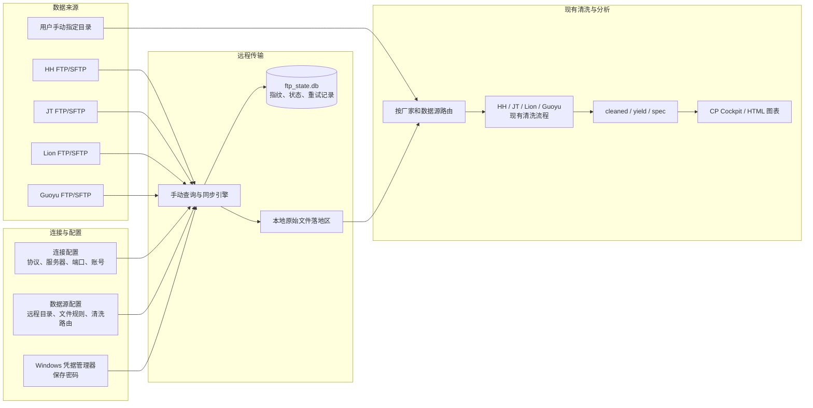
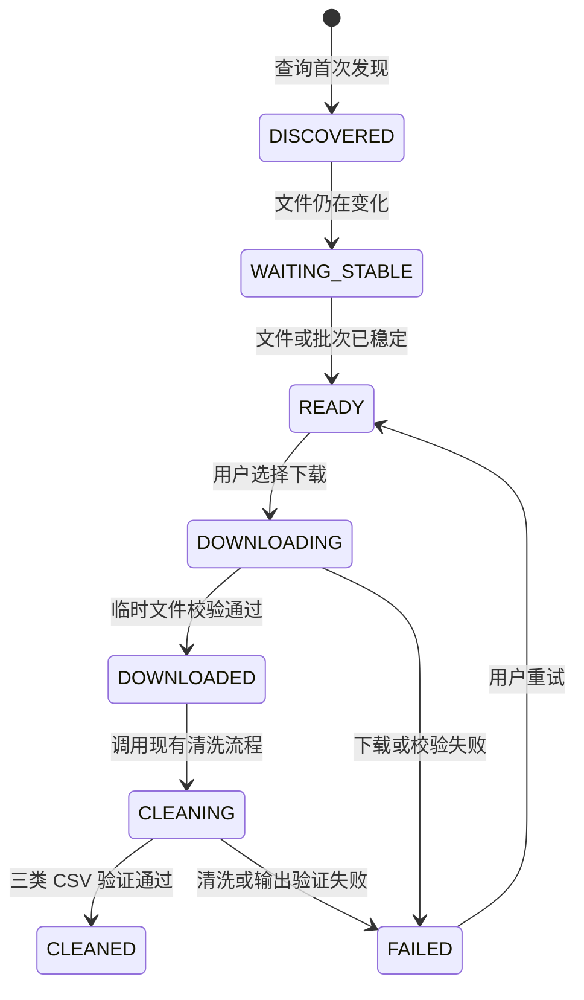

# CP 数据 FTP 接入设计（未来规划）

## 1. 文档状态

| 项目 | 内容 |
| --- | --- |
| 状态 | 设计预留，当前程序尚未实现 |
| 目标平台 | Windows 11 |
| 当前使用方式 | 用户手动选择本地原始数据目录并启动清洗 |
| 未来扩展 | 用户配置不同厂家的 FTP/SFTP/FTPS，手动查询新数据后选择下载并清洗 |
| 默认策略 | 手动同步为主，自动定时同步默认关闭 |

本文用于未来开发时统一业务原则、数据模型、目录规划、安全要求和验收标准。实施时应先重新核对各厂家的真实协议、目录规则和批次完成标志，不得直接把本文中的示例地址当作生产配置。

## 2. 已确认的业务原则

1. 现有“手动指定目录”流程必须保留，并继续作为主要入口。
2. `D:\CPData` 是可选的业务数据工作区，不是程序代码目录，也不是用户必须使用的输入位置。
3. FTP 仅负责获取原始文件；下载完成后仍调用现有 HH、JT、Lion、Guoyu 清洗流程。
4. 用户可自行维护服务器、协议、端口、账号、远程目录和文件规则。
5. 密码不得以明文写入 JSON、SQLite、日志或发布包。
6. 用户点击“查询 FTP 新数据”时才扫描服务器；第一阶段不启动常驻服务或五分钟定时任务。
7. 程序必须通过远程文件指纹和本地处理台账防止重复下载、重复清洗。
8. 只有标准 `cleaned / yield / spec` 文件生成并验证通过后，任务才可标记为清洗成功。
9. 初期 FTP 账号应使用只读权限，不自动删除或移动服务器文件。
10. FTP 接入不得改变标准 CSV 数据契约、`pass_bin`、单位转换或原始 `Lot_ID` 追溯逻辑。

## 3. 总体架构



FTP 模块是现有清洗流程之前的“数据获取层”。它不解析 CP 参数、不修改测试值，也不自行生成业务 CSV。

## 4. 配置模型

不要把配置简化为“一个厂家对应一个 FTP 账号”。推荐关系为：

```text
厂家 Factory
  -> 连接 ConnectionProfile（一个厂家可以有多个服务器或账号）
      -> 数据源 RemoteSource（一个连接可以有多个远程目录）
          -> 清洗路由 ProcessingRoute
```

### 4.1 厂家 Factory

| 字段 | 含义 | 示例 |
| --- | --- | --- |
| `factory_id` | 稳定的厂家代码 | `HH`、`JT`、`Lion`、`Guoyu` |
| `display_name` | GUI 显示名称 | `华虹宏力` |
| `enabled` | 是否可用 | `true` |

### 4.2 连接 ConnectionProfile

| 字段 | 含义 |
| --- | --- |
| `connection_id` | 连接唯一编号，例如 `hh_prod_sftp` |
| `factory_id` | 所属厂家 |
| `protocol` | `sftp`、`ftps` 或 `ftp` |
| `host` | 服务器域名或 IP |
| `port` | 端口；SFTP 常用 22，具体以厂家为准 |
| `username` | 登录账号 |
| `credential_ref` | Windows 凭据管理器中的引用名称 |
| `timeout_seconds` | 连接超时 |
| `passive_mode` | FTP/FTPS 是否使用被动模式 |
| `verify_server` | 是否验证 SFTP Host Key 或 FTPS 证书 |
| `enabled` | 是否启用该连接 |

连接配置不保存密码。同一服务器和账号下的多个远程目录应共用一个连接配置。

### 4.3 数据源 RemoteSource

| 字段 | 含义 |
| --- | --- |
| `source_id` | 数据源唯一编号，例如 `hh_cp_dcp` |
| `connection_id` | 使用的连接配置 |
| `remote_root` | FTP 远程根目录 |
| `file_patterns` | 文件匹配规则，例如 `*.dcp`、`*.xlsx` |
| `recursive` | 是否递归扫描子目录 |
| `ignored_patterns` | 忽略 `.tmp`、`.part` 等文件 |
| `batch_key_strategy` | 从目录名、文件名或清单提取批次号的规则 |
| `completion_mode` | 批次或文件上传完成的判断方式 |
| `local_landing_dir` | FTP 文件本地落地目录 |
| `processing_route` | 对应的现有清洗流程 |
| `output_parent` | 标准 CSV 输出父目录 |
| `enabled` | 是否参与查询 |

### 4.4 示例配置

下面仅为结构示例，不是生产服务器信息：

```json
{
  "version": 1,
  "connections": [
    {
      "connection_id": "hh_prod_sftp",
      "factory_id": "HH",
      "protocol": "sftp",
      "host": "sftp.example.local",
      "port": 22,
      "username": "cp_reader",
      "credential_ref": "CPDataAnalysis/FTP/hh_prod_sftp",
      "verify_server": true,
      "enabled": true
    }
  ],
  "sources": [
    {
      "source_id": "hh_cp_dcp",
      "connection_id": "hh_prod_sftp",
      "remote_root": "/outbound/cp/dcp",
      "file_patterns": ["*.dcp", "*.txt"],
      "ignored_patterns": ["*.tmp", "*.part"],
      "recursive": true,
      "batch_key_strategy": "parent_directory",
      "completion_mode": "quiet_window",
      "quiet_minutes": 10,
      "local_landing_dir": "D:\\CPData\\raw\\HH\\ftp\\hh_cp_dcp\\incoming",
      "processing_route": "huahong",
      "output_parent": "D:\\CPData\\output\\HH",
      "enabled": true
    }
  ]
}
```

建议非敏感配置保存到：

```text
D:\CPData\config\ftp_profiles.json
```

## 5. 凭据与安全

### 5.1 密码保存

- 密码保存到 Windows Credential Manager。
- 推荐凭据名称：`CPDataAnalysis/FTP/<connection_id>`。
- 配置文件只保存 `credential_ref`。
- GUI 再次打开时显示 `••••••`，密码框留空表示不修改原密码。
- 导出配置时只导出非敏感字段，不导出密码。

### 5.2 协议优先级

1. 优先使用 SFTP，并验证服务器 Host Key。
2. 其次使用 FTPS，并验证 TLS 证书。
3. 普通 FTP 仅用于受控内网或 VPN，不应跨互联网传输账号密码和业务数据。

### 5.3 权限与日志

- 初期使用只读账号，仅允许列目录和下载。
- 不自动删除或移动服务器文件。
- 日志不得记录密码、完整凭据对象或认证异常中的敏感内容。
- GUI 日志可显示连接名称、厂家、远程目录和处理状态。
- 发布包不得包含生产服务器地址、账号、真实文件或凭据。

## 6. 本地目录规划

```text
D:\CPData\
├─ config\
│  ├─ ftp_profiles.json          # 非敏感连接和数据源配置
│  └─ ftp_state.db               # 指纹、状态、重试和输出记录
├─ raw\
│  ├─ HH\
│  │  └─ ftp\
│  │     └─ hh_cp_dcp\
│  │        ├─ incoming\         # 下载完成、待清洗
│  │        ├─ archive\          # 已成功清洗的本地原始文件
│  │        └─ failed\           # 下载或清洗失败，等待人工处理
│  ├─ JT\
│  ├─ Lion\
│  └─ Guoyu\
├─ output\
│  ├─ HH\
│  ├─ JT\
│  ├─ Lion\
│  └─ Guoyu\
└─ logs\
   └─ ftp\
```

手动指定的原始文件可以位于任意本地目录或有权限的共享目录，不要求复制到 `D:\CPData\raw`。FTP 下载的数据必须先完整落地，再交给清洗程序，以便校验、重试和追溯。

## 7. 新数据识别

### 7.1 远程文件预指纹

首次扫描时不下载文件，也不对远程文件做全量哈希。预指纹使用：

```text
source_id + remote_full_path + size + modified_time
```

它用于快速判断：

- 该远程文件是否第一次出现；
- 同名文件的大小或修改时间是否发生变化；
- 已清洗文件是否可直接跳过。

### 7.2 下载后内容指纹

新文件下载完成后，在本地计算 SHA-256：

```text
sha256(local_file_content)
```

SHA-256 用于最终确认内容是否重复。已成功处理且内容未变化的文件不重复计算哈希，也不重复清洗。

### 7.3 同名文件重新上传

如果厂家覆盖了同名文件，只要大小、修改时间或 SHA-256 发生变化，就作为新版本处理。新版本必须创建新的时间戳输出目录，不能覆盖历史输出。

## 8. 文件和批次完成判断

发现远程文件不等于文件已经上传完成。程序必须先判断稳定性。

### 8.1 文件级完成规则

按可靠程度排序：

1. 厂家上传完成后生成 `.done` 或 `.ok` 标志文件。
2. 厂家先上传为 `.tmp`，完成后原子改名为正式文件。
3. 连续两次查询时文件大小和修改时间均不变。
4. 文件修改时间早于当前时间一定分钟数。

第一阶段推荐默认值：

- 忽略 `.tmp`、`.part` 和隐藏文件；
- 文件至少静置 2 分钟；
- 连续两次查询元数据不变后标记为稳定；
- 用户仍需手动选择并开始下载。

### 8.2 批次级完成规则

一个批次可能由多个 Wafer 文件组成，不能发现一个文件就立即清洗整个批次。每个数据源应配置一种完成方式：

| `completion_mode` | 适用条件 |
| --- | --- |
| `marker_file` | 厂家提供批次 `.done` 文件，最推荐 |
| `manifest` | 厂家提供应有文件数或 Wafer 清单 |
| `quiet_window` | 一段时间内没有新增或变化文件 |
| `manual_confirm` | 用户确认批次完整后执行 |

无法取得厂家完成标志时，建议使用“连续 10 分钟无新增或变化文件”，并在 GUI 中允许用户人工确认。

## 9. 本地处理台账

建议使用 SQLite：

```text
D:\CPData\config\ftp_state.db
```

### 9.1 远程文件台账 `remote_files`

| 字段 | 含义 |
| --- | --- |
| `id` | 本地记录 ID |
| `source_id` | 数据源编号 |
| `remote_path` | 远程完整路径 |
| `file_name` | 文件名 |
| `size` | 远程文件大小 |
| `modified_time` | 远程修改时间和时区 |
| `sha256` | 下载后的本地内容哈希 |
| `batch_key` | 归属批次 |
| `status` | 当前状态 |
| `first_seen_at` | 首次发现时间 |
| `last_seen_at` | 最近查询时间 |
| `downloaded_at` | 下载完成时间 |
| `cleaned_at` | 清洗成功时间 |
| `attempts` | 尝试次数 |
| `local_path` | 本地原始文件路径 |
| `output_dir` | 清洗输出目录 |
| `last_error` | 最近一次错误摘要 |

### 9.2 同步运行记录 `sync_runs`

记录每次用户点击查询或下载的开始时间、结束时间、连接、发现数量、下载数量、跳过数量、失败数量和操作者备注。

### 9.3 状态机



只有 `CLEANED` 状态表示“已清洗过”。发现本地文件或输出目录存在，不能代替台账状态。

## 10. 下载和清洗流程

### 10.1 查询新数据

用户点击“查询 FTP 新数据”时：

1. 连接启用的数据源。
2. 只读列出远程文件和目录。
3. 应用文件匹配和忽略规则。
4. 计算预指纹并与台账比较。
5. 更新 `DISCOVERED`、`WAITING_STABLE`、`READY` 状态。
6. 显示新发现、等待稳定、已清洗和失败任务。
7. 不下载文件、不启动清洗。

### 10.2 用户选择下载并清洗

1. 用户勾选 `READY` 文件或批次。
2. 下载为本地 `<filename>.part`。
3. 校验文件大小，必要时计算并核对 SHA-256。
4. 校验成功后原子改名为正式文件。
5. 根据 `processing_route` 调用现有厂家处理流程。
6. 输出目录统一视为父目录，由程序创建 `<批次号>_<YYYYMMDD_HHMMSS>`。
7. 验证 cleaned、yield、spec 文件及基本业务统计。
8. 成功后标记 `CLEANED`，失败则标记 `FAILED` 并保留错误信息。

### 10.3 幂等与故障恢复

- 程序重启后从 SQLite 状态继续，不依赖内存状态。
- 已 `CLEANED` 且 SHA-256 未变化的文件直接跳过。
- `DOWNLOADING` 中断留下的 `.part` 文件不能进入清洗流程。
- `FAILED` 任务允许用户重试，重试次数和错误历史应可查。
- 同一个 `source_id + remote_path + version` 同时只能有一个活动任务。
- 新版本输出不得覆盖旧版本输出。

## 11. GUI 设计

建议在多公司 GUI 增加一个共用的“FTP 数据同步”页面，而不是在每个厂家 Widget 中复制连接管理界面。

### 11.1 连接配置区域

- 厂家
- 连接名称
- 协议
- 服务器地址
- 端口
- 用户名
- 密码
- 超时时间
- 被动模式（FTP/FTPS）
- 验证服务器身份
- “保存配置”按钮
- “测试连接”按钮
- “浏览远程目录”按钮

“测试连接”只能执行连接、认证和目录读取，不下载、不删除文件。

### 11.2 数据源配置区域

- 连接配置
- 数据源名称
- 远程根目录
- 文件匹配规则
- 是否递归
- 批次识别规则
- 完成判断规则
- 本地落地目录
- 清洗流程
- 输出父目录
- 启用状态

### 11.3 查询和处理区域

主要按钮：

- `查询 FTP 新数据`
- `下载选中数据`
- `下载并清洗`
- `重试失败任务`
- `打开本地目录`

查询结果建议显示：

| 厂家/数据源 | 批次或文件 | FTP 状态 | 本地状态 | 建议操作 |
| --- | --- | --- | --- | --- |
| HH / hh_cp_dcp | FA61-8500 | 新发现且稳定 | 未下载 | 下载并清洗 |
| HH / hh_cp_dcp | FA61-8499 | 无变化 | 已清洗 | 跳过 |
| JT / jt_cp_result | LOT-1002 | 内容已更新 | 已有旧版本 | 重新清洗 |
| Lion / lion_cp | LOT-1001 | 上传中 | 等待稳定 | 暂不处理 |
| Guoyu / guoyu_frd | 257375 | 无变化 | 上次失败 | 重试 |

### 11.4 操作体验

- 自动同步开关默认关闭。
- 用户手动本地目录清洗不需要经过 FTP 页面或台账。
- 后台下载和清洗使用 `QThread`，不得阻塞 GUI。
- 运行期间禁用会影响任务的连接、路径和执行按钮。
- GUI 日志显示查询、下载、清洗和验证阶段，但不泄露密码。

## 12. 与现有代码的集成边界

建议新增共享模块：

```text
cp_data_processor/
└─ integrations/
   └─ remote_transfer/
      ├─ profile_store.py       # 非敏感配置
      ├─ credential_store.py    # Windows 凭据管理器
      ├─ protocol_client.py     # SFTP/FTPS/FTP 抽象
      ├─ remote_scanner.py      # 远程目录扫描与预指纹
      ├─ transfer_manager.py    # .part 下载、校验和原子改名
      ├─ ledger.py              # SQLite 台账
      └─ route_dispatcher.py    # 调用现有厂家处理器

gui/widgets/
└─ ftp_sync_widget.py           # 配置、查询、下载与清洗界面
```

职责边界：

- FTP 模块：连接、扫描、下载、校验、状态和路由。
- 公司 Reader/Processor：解析厂家格式、字段映射、单位转换和良率逻辑。
- `frontend/`：消费标准 CSV，不直接连接 FTP。
- GUI：工作流编排、状态展示和用户操作，不承载解析规则。

现有路由应保持：

| `processing_route` | 现有调用路径 |
| --- | --- |
| `huahong` | `clean_dcp_data.process_directory()` |
| `jetech` | `jt_data_processor.jt_main_processor.process_jt_files()` |
| `lion` | `lion_batch_processor` 成熟流程 |
| `guoyu` | `guoyu_batch_processor` 成熟流程 |

## 13. 性能和容量

远程查询只读取路径、大小和修改时间，不对所有远程文件反复计算哈希。

台账空间的粗略估算：

| 历史文件记录 | SQLite 预计空间（含索引） |
| ---: | ---: |
| 1 万条 | 约 10～30 MB |
| 10 万条 | 约 100～200 MB |
| 100 万条 | 约 1～2 GB |

实际大小取决于远程路径长度、错误信息和索引数量。CP 原始文件和输出数据通常远大于台账，因此第一阶段无需专门部署数据库服务器。可按年度归档历史任务，并定期执行 SQLite 压缩维护。

## 14. 分阶段实施建议

### 阶段 0：厂家信息确认

逐厂家收集并确认：

- 协议、服务器地址、端口；
- 是否需要 VPN、IP 白名单或防火墙放行；
- 只读账号和密码交付方式；
- SFTP Host Key 或 FTPS 证书；
- 远程根目录和子目录层级；
- 文件扩展名、命名规则和字符编码；
- 一个批次包含哪些文件；
- 批次完成标志或静默时间；
- 服务器时区、保留周期和覆盖同名文件的规则；
- 是否允许多个客户端同时访问。

### 阶段 1：手动配置、查询和下载

- 配置界面；
- Windows 凭据保存；
- 测试连接；
- 查询远程新数据；
- SQLite 台账；
- 手动选择下载；
- 下载完整性校验。

### 阶段 2：下载并清洗

- 按 `processing_route` 调用现有厂家处理器；
- 批次完成判断；
- 标准输出验证；
- 失败重试；
- GUI 状态和日志；
- 发布包依赖和安全审计。

### 阶段 3：可选自动化

在手动模式稳定后再评估：

- Windows Task Scheduler；
- 后台服务；
- 可配置同步周期；
- 失败告警；
- FTP 服务器归档或回执。

自动同步必须默认关闭，并复用与手动按钮完全相同的 `sync_once()` 和台账逻辑。

## 15. 验收测试清单

### 连接与安全

- 正确账号能测试连接并列目录。
- 错误账号只显示脱敏错误信息。
- 密码不出现在 JSON、SQLite、日志和发布包中。
- SFTP Host Key 或 FTPS 证书校验失败时拒绝连接。

### 新数据识别

- 首次查询能识别新文件。
- 再次查询未变化文件时标记为已知或已清洗。
- 同名文件大小、修改时间或内容变化时识别为新版本。
- 不同远程目录下的同名文件不会互相覆盖。

### 上传完整性

- 正在增长的文件保持 `WAITING_STABLE`。
- `.tmp`、`.part` 文件被忽略。
- 批次未完成时不能启动整批清洗。
- 完成标志、清单、静默窗口和人工确认规则分别可测试。

### 下载与恢复

- 下载中断只留下 `.part`，不能被清洗。
- 文件大小或 SHA-256 校验失败进入 `FAILED`。
- 程序重启后能够继续查询和重试。
- 重试不会产生重复的活动任务。

### 清洗与输出

- FTP 下载和手动目录对同一批数据调用相同处理器。
- HH、JT、Lion、Guoyu 分别生成兼容的标准 CSV。
- `pass_bin`、单位、规格和原始 `Lot_ID` 保持正确。
- 只有 cleaned、yield、spec 验证通过后才标记 `CLEANED`。
- 新版本输出不覆盖历史输出。

### GUI 与兼容性

- 手动本地目录清洗流程不受影响。
- 自动同步默认关闭。
- 查询新数据不下载、不删除服务器文件。
- 下载和清洗在后台线程运行，GUI 不冻结。
- 发布包不包含真实 FTP 配置、凭据或 CP 数据。

## 16. 开发启动条件

未来开始开发前，至少应具备：

1. 一个厂家的脱敏测试服务器或本地模拟 FTP/SFTP 环境；
2. 只读测试账号；
3. 可重复测试的完整批次与未完成批次样例；
4. 厂家的批次完成判断规则；
5. 现有手动清洗结果作为对照基线；
6. 对应协议所需 Python 依赖和发布环境评估。

建议先选一个厂家做完整闭环，验证“查询 → 下载 → 清洗 → 台账 → 重试”，再复用配置模型扩展到其他厂家。
