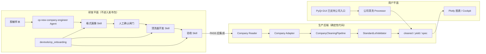

# 新晶圆厂接入研发架构

## 1. 目标与边界

本方案用于“第一次接入新的稳定晶圆厂格式”或“已支持晶圆厂出现新的固定格式版本”。它不是生产环境的万能 AI 清洗器。

- Agent 与 Skills 面向开发人员，负责识别、提问、生成和验收。
- 生产后端只运行确定性的 Reader、Adapter、Validator、Pipeline 和 CSV 生成器。
- GUI 面向普通用户，只展示已完成测试和发布验收的晶圆厂清洗入口。
- 未知格式必须明确报错并停止，不能在 GUI 后台调用 Agent 猜测。

## 2. 三平面架构



## 3. 模块职责

| 模块 | 职责 | 是否进入用户发布包 |
| --- | --- | ---: |
| `.codex/agents/cp-new-company-engineer.toml` | 新晶圆厂接入总控 Agent | 否 |
| `.agents/skills/cp-*new-company*` | 格式画像、开发、验收与阶段编排 SOP | 否 |
| `devtools/cp_onboarding/` | 脱敏画像、档案校验、骨架生成、CSV 对账 | 否 |
| `cp_data_processor/readers/` | 原始格式解析 | 是 |
| `cp_data_processor/readers/company_adapters/` | 字段映射、单位转换、公司识别 | 是 |
| `cp_data_processor/validation/` | 公司无关的标准 `CPLot` 契约校验 | 是 |
| `cp_data_processor/processing/company_cleaning_pipeline.py` | 组合未来公司的 Reader、Adapter、校验与 CSV 输出 | 是 |
| `gui/widgets/` | 已验收清洗器的用户操作编排 | 是 |

发布脚本只打包白名单生产包，因此 `.codex/`、`.agents/` 和 `devtools/` 不会进入 `app.pyz`。

## 4. 标准接入生命周期

### 阶段 A：格式画像

1. 收集 3～5 片代表性脱敏样本，尽量覆盖两个 Lot。
2. 运行结构画像工具，识别真实文件签名、编码、Sheet、表头、数据区和规格区。
3. 形成 `format-profile.json`、字段映射表和待确认问题。
4. 把事实、假设、问题分开记录。

### 阶段 B：人工批准

必须明确产品、Lot、Wafer、X/Y、Seq、Bin、Pass Bin、参数、单位、规格、无效值、重复 Die、Retest、过滤规则和缺失坐标/规格策略。任一关键项未确认，不得生成生产代码。

### 阶段 C：确定性清洗器开发

1. 从已批准档案生成 staging 骨架。
2. 实现 Reader、Adapter、内容指纹和测试。
3. 优先组合 `CompanyCleaningPipeline`；只有目录发现或多批次合并确实特殊时才增加薄的公司 Processor。
4. 不复制公司专用图表栈。

### 阶段 D：独立验收

对账源文件、cleaned、yield、spec：

- 每个 `Lot_ID + Wafer_ID` 的 Die 数；
- Bin 计数、Good Die 与批准的 `pass_bin`；
- 良率、参数数、单位和上下限；
- 无效值、重复 Die、Retest 和被排除行；
- 错厂文件和破损文件是否 fail closed。

只有 `PASS` 才能进入 GUI、图表和发布阶段。

### 阶段 E：GUI 与发布

GUI 继续采用用户熟悉的流程：选择晶圆厂 → 选择文件夹或 ZIP → 清洗 → 输出 CSV 和图表。新入口不得出现 Agent、Skill、置信度或映射确认控件。完成后必须验证源码、发布包 `app.pyz` 和实际启动检查。

## 5. 开发工具命令

```powershell
# 生成脱敏结构画像
python -m devtools.cp_onboarding profile --input <samples> --output <case>\sample-profile.json

# 检查档案；进入开发前必须加 --require-approved
python -m devtools.cp_onboarding validate-profile --profile <case>\format-profile.json --require-approved

# 在空 staging 目录生成 Reader/Adapter/Processor/测试骨架
python -m devtools.cp_onboarding scaffold --profile <case>\format-profile.json --output-dir <staging>

# 对账标准 CSV
python -m devtools.cp_onboarding validate-output --profile <profile.json> --cleaned <cleaned.csv> --yield-file <yield.csv> --spec <spec.csv> --report <acceptance.json>
```

## 6. 现有公司的迁移策略

- HH、JT、Lion、国宇继续使用当前已经验证的成熟流程。
- 新增晶圆厂默认采用 Reader + Adapter + `CompanyCleaningPipeline`。
- 不为追求形式统一一次性重写四条旧链路。
- 后续按“黄金样本回归结果完全一致”的原则逐条迁移公共能力。

## 7. 后续维护路线

1. 为四家公司补齐最小脱敏黄金样本和三类 CSV contract tests。
2. 修复 `frontend` null bytes，恢复全包编译检查。
3. 将 `company_config.py` 按公司拆分配置模块，消除单文件持续膨胀。
4. 逐步消除 `UnifiedReader`、`reader_factory` 与公司专用 Processor 之间的识别分歧。
5. 只有在业务结果回归一致后，才迁移兼容路径并删除旧代码。
